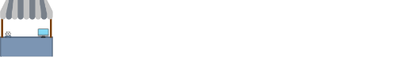
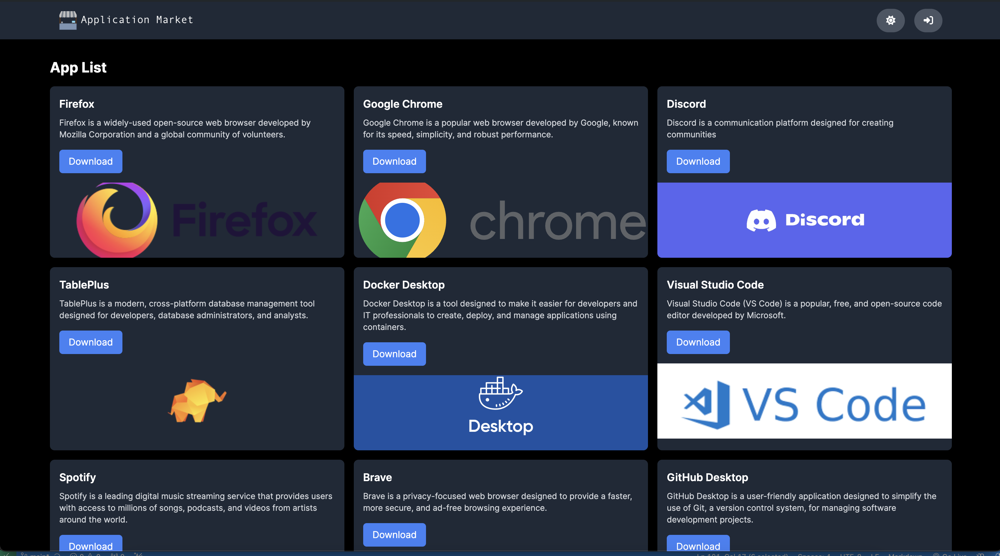
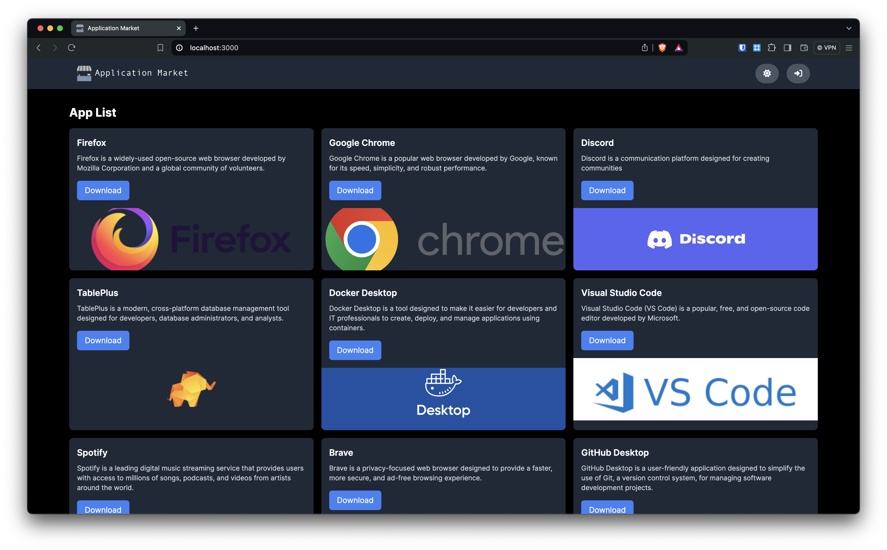
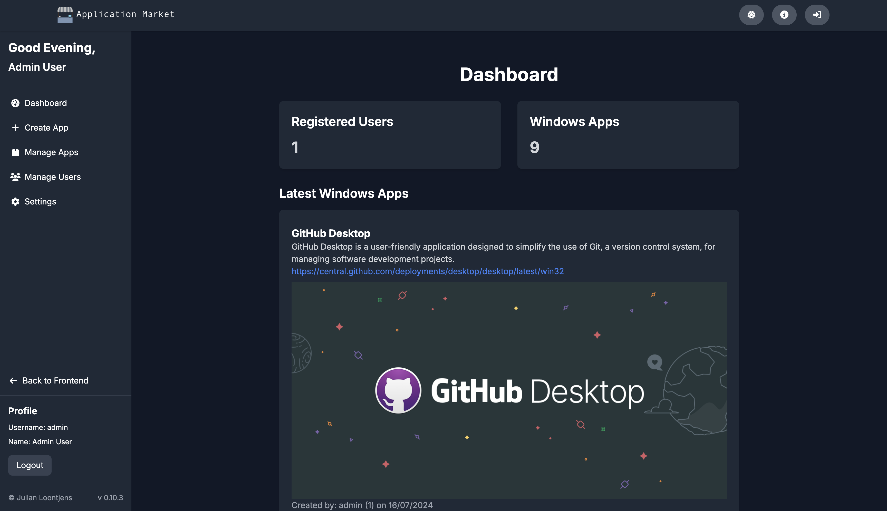

## Application Market


## Welkom!
Welkom bij Application Market! Application Market is een platform voor het beheren en downloaden van applicaties. Deze repository bevat de frontend, API en database configuraties.



## Inhoud

- [Installatie](#installatie)
- [Omgevingsvariabelen](#omgevingsvariabelen)
- [Gebruik](#gebruik)
- [Projectstructuur](#projectstructuur)
- [Contributie](#contributie)
- [Screenshots](#Screenshots)

## Installatie

Zorg ervoor dat je de volgende vereisten hebt geïnstalleerd:

- [Docker](https://www.docker.com/)
- [Docker Compose](https://docs.docker.com/compose/)

### Stappen

1. Clone de repository:

    ```sh
    git clone https://gitlab.com/julienloon/application-market.git
    cd application-market
    ```

2. Maak een `.env` bestand in de root van het project en voeg de vereiste omgevingsvariabelen toe. Je kunt de `.env.example` gebruiken als voorbeeld:

    ```sh
    cp .env.example .env
    ```

3. Vul de waarden in het `.env` bestand in:

    ```env
    MYSQL_ROOT_PASSWORD=your_root_password_here
    MYSQL_DATABASE=your_database_name_here
    MYSQL_USER=your_database_user_here
    MYSQL_PASSWORD=your_database_password_here
    JWT_SECRET=your_jwt_secret_here
    ```

4. Start de services:

    ```sh
    docker-compose up --build
    ```

De applicatie zou nu beschikbaar moeten zijn op `http://localhost:3000` voor de frontend en `http://localhost:3002` voor de API.

## Omgevingsvariabelen

De volgende omgevingsvariabelen zijn vereist en moeten worden ingesteld in een `.env` bestand in de root van het project:

- `MYSQL_ROOT_PASSWORD`: Het root wachtwoord voor de MySQL database.
- `MYSQL_DATABASE`: De naam van de MySQL database.
- `MYSQL_USER`: De gebruikersnaam voor de MySQL database.
- `MYSQL_PASSWORD`: Het wachtwoord voor de MySQL gebruiker.
- `JWT_SECRET`: Een geheime sleutel voor JWT authenticatie.

## Gebruik

Na het starten van de services kun je de volgende URLs bezoeken:

- Frontend: [http://localhost:3000](http://localhost:3000)
- API: [http://localhost:3002](http://localhost:3002)

U kunt inloggen met de standaard gebruiker:

- Username: admin
- Wachtwoord: WelcomeToApplicationMarket

### API Endpoints

Hier zijn enkele van de belangrijkste API endpoints:

- `GET /api/users`: Haal alle gebruikers op
- `POST /api/users`: Maak een nieuwe gebruiker aan
- `GET /api/apps/windows_apps`: Haal alle Windows applicaties op
- `POST /api/apps/windows_apps`: Maak een nieuwe Windows applicatie aan

## Projectstructuur

De repository bevat de volgende mappen:

- `app/`: De frontend applicatie, gebouwd met Next.js
- `api/`: De backend API, gebouwd met Node.js en Express
- `data/`: De map waar de MySQL data wordt opgeslagen
- `docker-compose.yml`: De Docker Compose configuratie

## Contributie

Contributies zijn welkom! Volg deze stappen om bij te dragen:

1. Fork de repository
2. Maak een nieuwe branch (`git checkout -b feature/naam-van-feature`)
3. Commit je veranderingen (`git commit -am 'Voeg een nieuwe feature toe'`)
4. Push naar de branch (`git push origin feature/naam-van-feature`)
5. Open een Pull Request

## Screenshots

Hier zijn enkele screenshots van de frontend en backend:

### Frontend



### Backend



##
&copy; 2024 - Julian Loontjens 